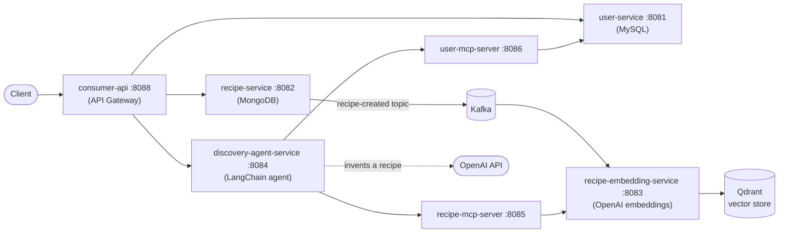

# Recipe Management App

A microservices-based recipe platform: users manage recipes through a REST gateway, recipe
creation events flow through Kafka into a vector store, and an LLM agent uses MCP tools to
discover or invent recipes from a list of ingredients.

## Architecture



**Flow summary**

1. A client talks only to **consumer-api**, which proxies requests to the internal services.
2. Creating/updating/deleting a recipe in **recipe-service** publishes an event to the Kafka
   topic `recipe-created` (a `null` value is a tombstone for deletions).
3. **recipe-embedding-service** consumes that topic, embeds the recipe text with OpenAI
   (`text-embedding-3-large`), and upserts it into **Qdrant**.
4. For "find me something to cook" requests, **discovery-agent-service** runs a LangChain
   agent (`gpt-4.1-mini`) that calls two MCP servers as tools:
   - **recipe-mcp-server** → searches the user's existing recipes by ingredient similarity
     (via recipe-embedding-service).
   - **user-mcp-server** → looks up the user's dietary preferences (via user-service).
   If no matching recipe exists, the agent invents one that fits the ingredients and the
   user's preferences instead of returning nothing.

## Services

| Service | Port | Responsibility | Storage / Dependencies |
|---|---|---|---|
| [consumer-api](consumer-api) | 8088 | Public API gateway; proxies to user, recipe, and discovery services | — |
| [user-service](user-service) | 8081 | User CRUD (profile, dietary restrictions, preferences) | MySQL |
| [recipe-service](recipe-service) | 8082 | Recipe CRUD; publishes create/update/delete events | MongoDB, Kafka (producer) |
| [recipe-embedding-service](recipe-embedding-service) | 8083 | Consumes recipe events, generates embeddings, similarity search | Kafka (consumer), Qdrant, OpenAI |
| [discovery-agent-service](discovery-agent-service) | 8084 | LLM agent that finds or invents a recipe from ingredients | OpenAI, MCP servers |
| [recipe-mcp-server](recipe-mcp-server) | 8085 | MCP tool wrapper: `get_recipe_by_ingredient` | recipe-embedding-service |
| [user-mcp-server](user-mcp-server) | 8086 | MCP tool wrapper: `get_user_by_id` | user-service |

### Infrastructure

| Component | Role |
|---|---|
| MySQL | User records (`recipe_user_db`) |
| MongoDB | Recipe documents |
| Kafka + Zookeeper | `recipe-created` event stream between recipe-service and recipe-embedding-service |
| Qdrant | Vector store for ingredient-similarity search |

## Tech stack

- **API layer:** FastAPI, Pydantic, uvicorn
- **Persistence:** SQLAlchemy + PyMySQL (users), Beanie/Motor over MongoDB (recipes), Qdrant (vectors)
- **Messaging:** Kafka via aiokafka
- **AI/Agents:** LangChain, LangGraph, `langchain-mcp-adapters`, OpenAI (`gpt-4.1-mini`, `text-embedding-3-large`)
- **MCP:** FastMCP (streamable-HTTP transport)
- **Packaging:** Docker / Docker Compose, one Dockerfile per service

## Getting started

### Prerequisites

- Docker and Docker Compose
- An OpenAI API key (used by `recipe-embedding-service` and `discovery-agent-service`)

### Run everything

```bash
export OPENAI_API_KEY=sk-...
docker compose up --build
```

This starts the infrastructure (MySQL, MongoDB, Kafka/Zookeeper, Qdrant) and all seven
application services, wired together with the URLs and credentials in
[docker-compose.yml](docker-compose.yml). Each service also has its own Dockerfile if you
need to build or run it standalone.

### Local (non-Docker) development

Each service is an independent FastAPI (or FastMCP) app with its own `requirements.txt`.
From a service directory:

```bash
python -m venv .venv && source .venv/bin/activate
pip install -r requirements.txt
uvicorn main:app --reload --port <service-port>   # or `python <name>-server.py` for the MCP servers
```

Services read their downstream URLs from environment variables (e.g. `USER_SERVICE_URL`,
`RECIPE_SERVICE_URL`, `KAFKA_BOOTSTRAP_SERVERS`, `QDRANT_URL`) with `localhost`-based
defaults, so standing up the infra containers alone (`docker compose up mysql mongodb kafka
zookeeper qdrant`) and running services natively also works.

### Key environment variables

| Variable | Used by | Purpose |
|---|---|---|
| `DATABASE_URL` | user-service | MySQL connection string |
| `MONGO_URL` | recipe-service | MongoDB connection string |
| `KAFKA_BOOTSTRAP_SERVERS` | recipe-service, recipe-embedding-service | Kafka broker address |
| `QDRANT_URL` | recipe-embedding-service | Qdrant endpoint |
| `OPENAI_API_KEY` | recipe-embedding-service, discovery-agent-service | OpenAI API access |
| `USER_SERVICE_URL` | consumer-api, user-mcp-server | Address of user-service |
| `RECIPE_SERVICE_URL` | consumer-api | Address of recipe-service |
| `RECIPE_EMBEDDING_SERVICE_URL` | recipe-mcp-server | Address of recipe-embedding-service |
| `AGENT_SERVICE_URL` | consumer-api | Address of discovery-agent-service |
| `RECIPE_MCP_URL` / `USER_MCP_URL` | discovery-agent-service | MCP server endpoints (`/mcp`) |

## API reference (via consumer-api, `:8088`)

| Method | Path | Description |
|---|---|---|
| `POST` | `/user` | Create a user |
| `GET` | `/user/{user_id}` | Fetch a user |
| `PUT` | `/user/{user_id}` | Update a user |
| `POST` | `/user/{user_id}/recipe` | Create a recipe |
| `GET` | `/user/{user_id}/recipe/{recipe_id}` | Fetch a recipe |
| `PUT` | `/user/{user_id}/recipe/{recipe_id}` | Update a recipe |
| `DELETE` | `/user/{user_id}/recipe/{recipe_id}` | Delete a recipe |
| `POST` | `/user/{user_id}/inspiration` | Find or invent a recipe from a list of ingredients (via discovery-agent-service) |

## Project structure

```
recipe-management-app/
├── consumer-api/              # Public API gateway
├── user-service/              # User CRUD (MySQL)
├── recipe-service/            # Recipe CRUD + Kafka producer (MongoDB)
├── recipe-embedding-service/  # Kafka consumer → OpenAI embeddings → Qdrant
├── discovery-agent-service/   # LangChain agent for recipe discovery
├── recipe-mcp-server/         # MCP tool: recipe search by ingredient
├── user-mcp-server/           # MCP tool: user lookup
└── docker-compose.yml         # Full stack: infra + all services
```
